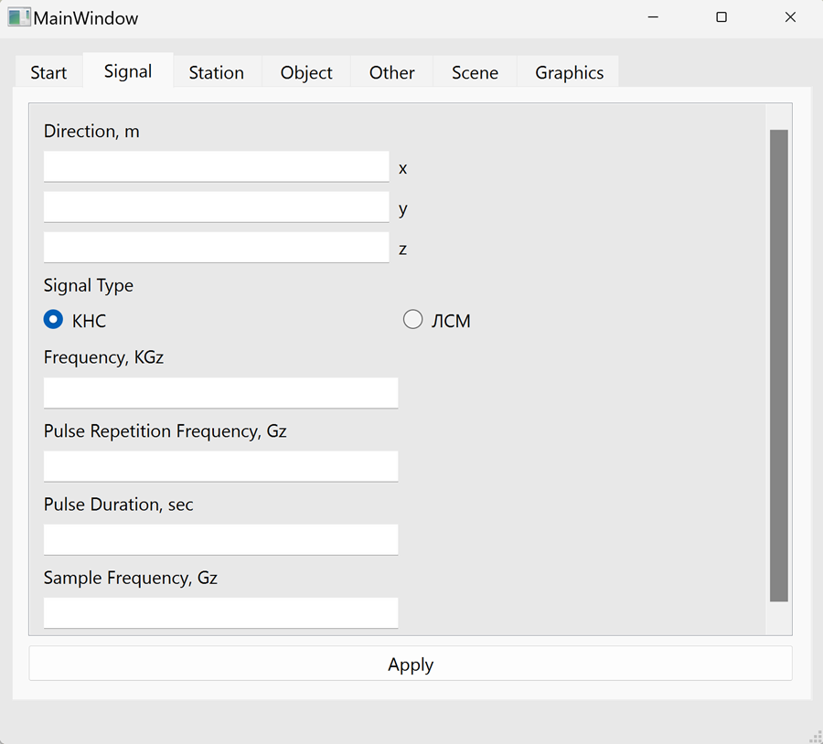
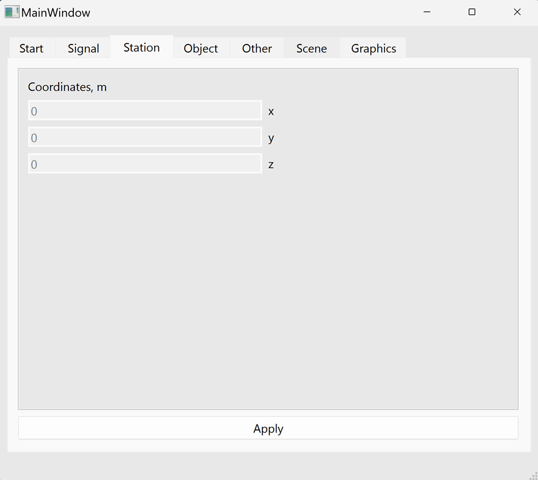
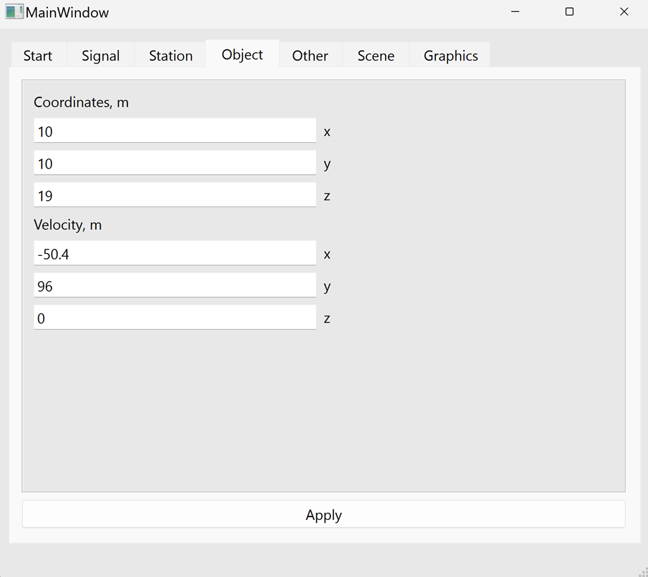
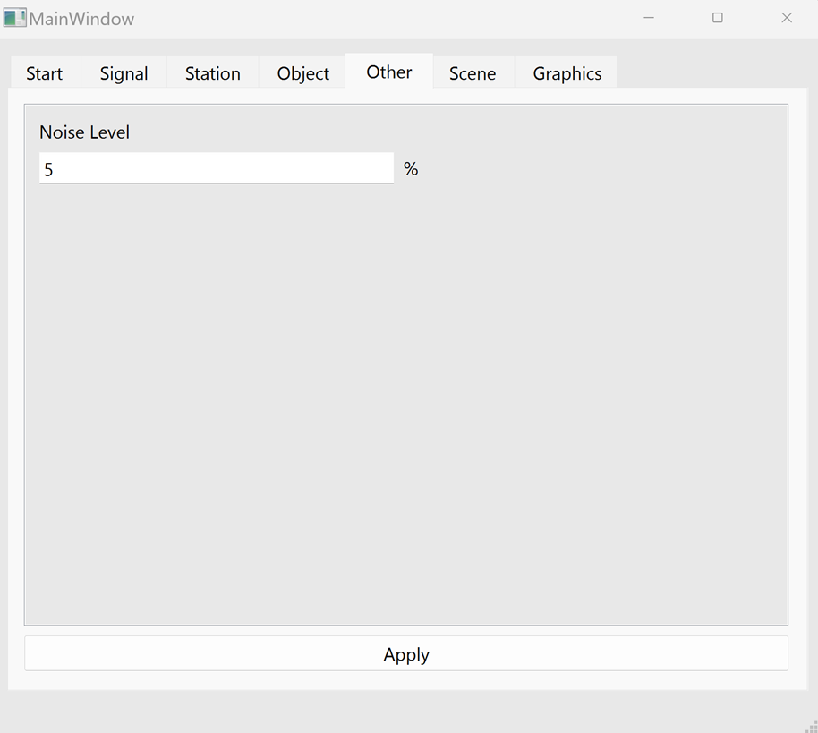
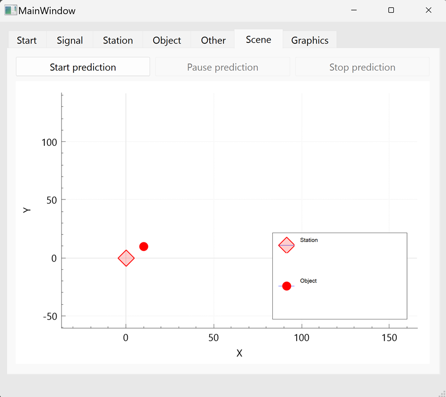
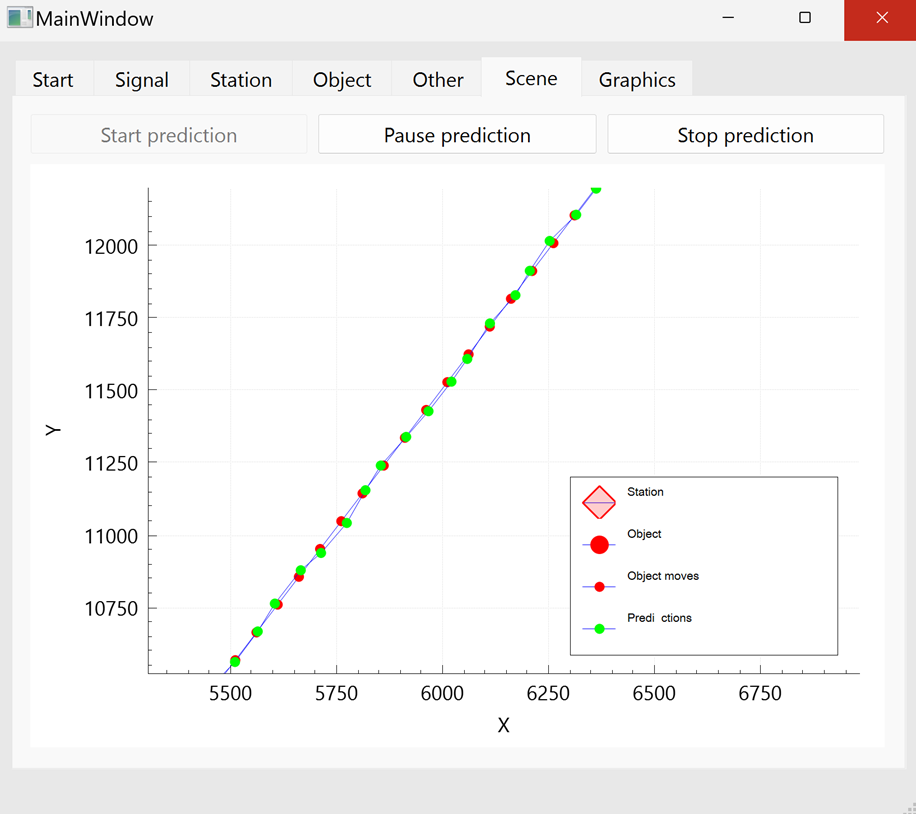
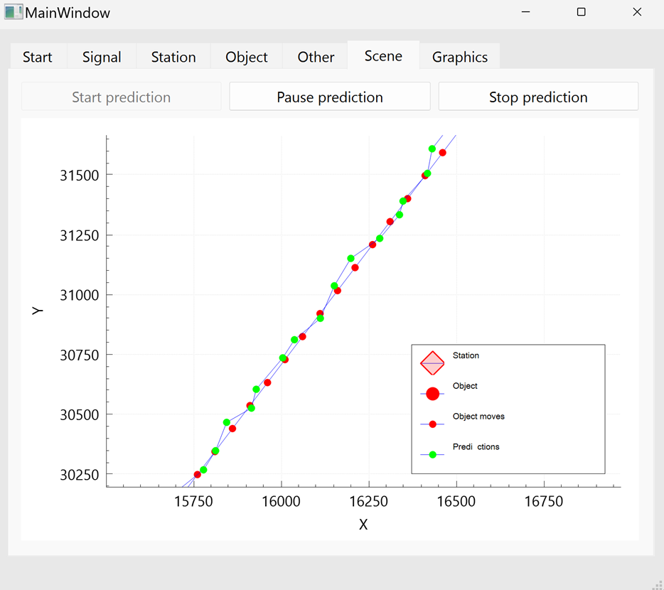
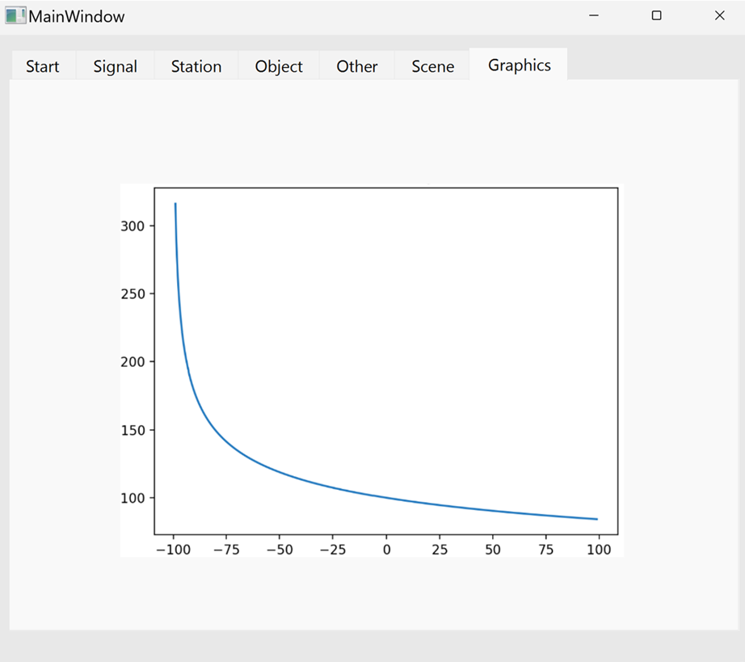

# The Reflected Signal Simulator

## Description

This program module simulates reflected signals for modeling signal propagation in environments. This file will guide you on how to use the program for conducting signal propagation simulations and analyzing the results.

## System Requirements

### Minimum System Requirements:
- **OS:** Microsoft® Windows 11
- **CPU:** Intel(R) Core(TM) i7-8550U CPU @ 1.80GHz 1.99 GHz

### Recommended System Requirements:
- **OS:** Microsoft® Windows 11
- **CPU:** Intel(R) Core(TM) i7-8550U CPU @ 1.80GHz 1.99 GHz

**Software:**
- c++17
- qt6, qcustomplot

## Running the Program

1. Launch the program using the CMake build system.
2. After launching, a welcome window of the program will appear (Start tab).

3. Fill in the input fields (Signal, Station, Object, Other tabs).

4. Go to the Scene tab for predicting object movement.

5. In the Graphics tab, view the graph showing the accuracy prediction dependency on noise level.

## Main Features:

1. Visualization of object movement prediction.
   - Enter input data (see above).
   - Run the prediction in the Scene tab.
2. Calculation of accuracy prediction dependency on noise level.
   - In the Graphics tab.
3. Saving prediction results.
   - After entering input data, a file named after the object is created, displaying the real position of the object, predicted position of the object, and calculation error.
   

## Project Development Capabilities

- Adding several objects to the field.
- Drawing velocity vectors.
- Considering a greater number of environmental parameters.

## Authors

- Ryabchikov Mikhail
- Fazlyev Niyaz
- Chizikova Yaroslava
